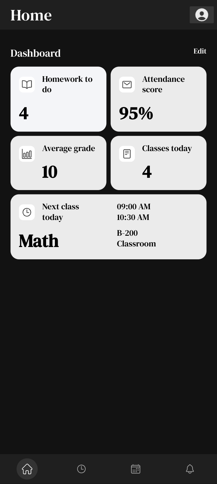

# Comprehensive Ionic Angular Project Documentation

## Table of Contents
- [Project Overview](#project-overview)
- [Prerequisites](#prerequisites)
- [Understanding Ionic Angular Architecture](#understanding-ionic-angular-architecture)
- [Node.js Version Management](#nodejs-version-management)
- [Project Setup and Installation](#project-setup-and-installation)
- [Common Issues and Solutions](#common-issues-and-solutions)
- [Project Structure Explained](#project-structure-explained)
- [Development Workflow](#development-workflow)
- [Build and Deployment](#build-and-deployment)
- [Troubleshooting Guide](#troubleshooting-guide)
- [Best Practices](#best-practices)

---


## Demo
Here's a quick look at the web application:




---

## Project Overview

This is an **Ionic Angular** project created in **2021** for Ionic Angular UI School. Ionic is a popular framework for building cross-platform mobile applications using web technologies (HTML, CSS, JavaScript/TypeScript).

### What is Ionic?
- **Ionic** is a framework for building mobile apps using web technologies
- **Angular** is the underlying framework that provides the application structure
- Together, they allow you to write one codebase that runs on iOS, Android, and web browsers

### Key Technologies Used:
- **Ionic Framework**: UI components and mobile functionality
- **Angular**: Application framework and structure
- **TypeScript**: Programming language (superset of JavaScript)
- **Node.js**: Runtime environment for development tools
- **npm**: Package manager for JavaScript dependencies

---

## Prerequisites

Before starting, ensure you have the following installed:

### 1. Node.js and npm
```bash
# Check if Node.js is installed
node --version

# Check if npm is installed
npm --version
```

### 2. Git (for version control)
```bash
# Check if Git is installed
git --version
```

### 3. Code Editor
- **Visual Studio Code** (recommended)
- **WebStorm**
- **Sublime Text**

---

## Understanding Ionic Angular Architecture

### How Ionic Angular Works

```
┌─────────────────────────────────────────────────────────────┐
│                    Ionic Angular App                        │
├─────────────────────────────────────────────────────────────┤
│  ┌─────────────┐  ┌─────────────┐  ┌─────────────┐         │
│  │    Pages    │  │ Components  │  │  Services   │         │
│  │             │  │             │  │             │         │
│  │ - Home      │  │ - Header    │  │ - API       │         │
│  │ - About     │  │ - Footer    │  │ - Auth      │         │
│  │ - Contact   │  │ - Cards     │  │ - Data      │         │
│  └─────────────┘  └─────────────┘  └─────────────┘         │
├─────────────────────────────────────────────────────────────┤
│                    Angular Framework                        │
├─────────────────────────────────────────────────────────────┤
│                    Ionic Framework                          │
├─────────────────────────────────────────────────────────────┤
│               Web Technologies (HTML/CSS/JS)                │
└─────────────────────────────────────────────────────────────┘
```

### Application Flow

1. **User Interface**: Built with Ionic components
2. **Business Logic**: Handled by Angular services and components
3. **Data Management**: Angular services manage API calls and data
4. **Routing**: Angular Router handles navigation between pages
5. **Build Process**: Webpack bundles everything for deployment

---

## Node.js Version Management

### Why Node.js Version Matters

Different projects require different Node.js versions because:
- **Dependencies**: Older projects use older packages
- **Security**: Newer Node.js versions have stricter security
- **compatibility**: Build tools may not work with very new Node.js versions

### Understanding the Version Issue

**This 2021 project** was built when:
- Node.js 14-16 was current
- Webpack 4/5 used older crypto algorithms
- OpenSSL 1.1.1 was standard

**Modern Node.js (22+)** has:
- OpenSSL 3.0 with deprecated MD4 hash
- Stricter security policies
- Incompatibility with older build tools

### Installing Node Version Manager (nvm)

```bash
# Install nvm (Node Version Manager)
curl -o- https://raw.githubusercontent.com/nvm-sh/nvm/v0.39.0/install.sh | bash

# Restart your terminal or source your profile
source ~/.zshrc    # For zsh (macOS default)
source ~/.bashrc   # For bash

# Verify nvm installation
nvm --version
```

### Managing Node.js Versions

```bash
# List available Node.js versions
nvm list-remote

# Install Node.js 18.16.0 (recommended for this project)
nvm install 18.16.0

# Use a specific version
nvm use 18.16.0

# Check current version
node --version

# Set default version
nvm alias default 18.16.0

# List installed versions
nvm list
```

### Why Node.js 18.16.0 Works Best

```bash
# Node.js 18.16.0 provides:
# ✅ Supports --openssl-legacy-provider flag
# ✅ Compatible with 2021-era dependencies
# ✅ Stable and well-tested
# ✅ Good balance between compatibility and features
```

---

## Project Setup and Installation

### Step 1: Clone the Repository

```bash
# Clone the project
git clone <repository-url>
cd habibalmawali-ui-2021-school

# Check project structure
ls -la
```

### Step 2: Set Up Node.js Environment

```bash
# Use Node.js 18.16.0
nvm use 18.16.0

# Verify version
node --version  # Should show v18.16.0

# Clear any existing NODE_OPTIONS
unset NODE_OPTIONS
```

### Step 3: Install Dependencies

```bash
# Remove existing dependencies (if any)
rm -rf node_modules package-lock.json

# Install dependencies with legacy peer deps (for compatibility)
npm install --legacy-peer-deps
```

**Why `--legacy-peer-deps`?**
- Older projects may have peer dependency conflicts
- This flag tells npm to use the old dependency resolution algorithm
- Prevents installation failures due to version mismatches

### Step 4: Install Global Tools

```bash
# Install latest Ionic CLI globally
npm install -g @ionic/cli@latest

# Install Angular CLI globally (optional)
npm install -g @angular/cli@latest

# Verify installations
ionic --version
ng --version
```

---

## Common Issues and Solutions

### Issue 1: OpenSSL Digital Envelope Routines Error

**Error Message:**
```
Error: error:0308010C:digital envelope routines::unsupported
```

**Root Cause:**
- Node.js 17+ uses OpenSSL 3.0
- Webpack 4/5 uses deprecated MD4 hash algorithm
- OpenSSL 3.0 doesn't support MD4 by default

**Solution:**
```bash
# Method 1: Set environment variable for session
export NODE_OPTIONS="--openssl-legacy-provider"
ionic serve

# Method 2: Inline command
NODE_OPTIONS="--openssl-legacy-provider" ionic serve

# Method 3: Add to package.json scripts
{
  "scripts": {
    "start": "NODE_OPTIONS='--openssl-legacy-provider' ionic serve",
    "build": "NODE_OPTIONS='--openssl-legacy-provider' ionic build"
  }
}
```

### Issue 2: Peer Dependency Conflicts

**Error Message:**
```
npm ERR! peer jasmine-core@">=3.8" from karma-jasmine-html-reporter@1.7.0
```

**Root Cause:**
- Package versions have become incompatible over time
- Strict peer dependency checking fails

**Solution:**
```bash
# Use legacy peer deps flag
npm install --legacy-peer-deps

# Or force the installation
npm install --force
```

### Issue 3: Port Already in Use

**Error Message:**
```
Error: listen EADDRINUSE: address already in use :::8100
```

**Root Cause:**
- Another process is using port 8100
- Previous ionic serve process didn't close properly

**Solution:**
```bash
# Check what's using the port
lsof -i :8100

# Kill the process (replace PID with actual process ID)
kill -9 <PID>

# Or use a different port
ionic serve --port=8101
```

### Issue 4: NODE_OPTIONS Not Allowed

**Error Message:**
```
node: --legacy-openssl-provider is not allowed in NODE_OPTIONS
```

**Root Cause:**
- Node.js 22+ restricts certain flags in NODE_OPTIONS
- Security enhancement in newer Node.js versions

**Solution:**
```bash
# Downgrade to Node.js 18
nvm install 18.16.0
nvm use 18.16.0

# Use correct flag name
NODE_OPTIONS="--openssl-legacy-provider" ionic serve
```

---

## Project Structure Explained

### Root Directory Structure

```
habibalmawali-ui-2021-school/
├── src/                      # Source code
├── node_modules/             # Dependencies (generated)
├── www/                      # Built app (generated)
├── android/                  # Android platform files
├── ios/                      # iOS platform files
├── package.json              # Project dependencies and scripts
├── package-lock.json         # Locked dependency versions
├── angular.json              # Angular configuration
├── ionic.config.json         # Ionic configuration
├── tsconfig.json             # TypeScript configuration
├── capacitor.config.ts       # Capacitor configuration
└── README.md                 # Project documentation
```

### Source Code Structure (`src/` directory)

```
src/
├── app/                      # Main application code
│   ├── components/           # Reusable UI components
│   ├── pages/                # Application pages/screens
│   ├── services/             # Business logic and API calls
│   ├── models/               # Data models and interfaces
│   ├── guards/               # Route guards for navigation
│   ├── pipes/                # Custom data transformation pipes
│   ├── app-routing.module.ts # Application routing configuration
│   ├── app.component.ts      # Root component
│   ├── app.component.html    # Root component template
│   ├── app.component.scss    # Root component styles
│   └── app.module.ts         # Root module
├── assets/                   # Static assets (images, fonts)
├── environments/             # Environment-specific configurations
├── theme/                    # Global styling and themes
├── index.html                # Main HTML file
├── main.ts                   # Application entry point
├── polyfills.ts              # Browser compatibility fixes
└── global.scss               # Global styles
```

### Key Files Explained

#### `package.json`
```json
{
  "name": "habibalmawali-ui-2021-school",
  "version": "0.0.1",
  "scripts": {
    "start": "ionic serve",
    "build": "ionic build",
    "test": "ng test"
  },
  "dependencies": {
    "@ionic/angular": "^5.x.x",
    "@angular/core": "^12.x.x"
  },
  "devDependencies": {
    "@angular/cli": "^12.x.x",
    "typescript": "^4.x.x"
  }
}
```

#### `ionic.config.json`
```json
{
  "name": "habibalmawali-ui-2021-school",
  "integrations": {
    "capacitor": {}
  },
  "type": "angular"
}
```

#### `angular.json`
- Contains Angular CLI configuration
- Defines build configurations
- Specifies file paths and build options

---

## Development Workflow

### 1. Starting Development Server

```bash
# Set up environment
nvm use 18.16.0
export NODE_OPTIONS="--openssl-legacy-provider"

# Start development server
ionic serve

# Or with specific port
ionic serve --port=8101

# Or with additional options
ionic serve --host=localhost --port=8101 --open
```

**What happens when you run `ionic serve`:**

1. **Compilation**: TypeScript files are compiled to JavaScript
2. **Bundling**: Webpack bundles all files together
3. **Development Server**: Starts a local server (usually on port 8100)
4. **Live Reload**: Watches for file changes and reloads automatically
5. **Browser Opens**: Automatically opens your default browser

### 2. Development Commands

```bash
# Generate new page
ionic generate page contact

# Generate new component
ionic generate component header

# Generate new service
ionic generate service data

# Generate new guard
ionic generate guard auth

# Run tests
npm test

# Run end-to-end tests
npm run e2e

# Lint code
npm run lint
```

### 3. File Watching and Live Reload

When you save files, the development server automatically:
- Recompiles changed files
- Updates the browser without full page reload
- Shows compilation errors in the terminal and browser

---

## Build and Deployment

### Development Build

```bash
# Build for development
ionic build

# Build with specific configuration
ionic build --configuration=development
```

### Production Build

```bash
# Build for production
export NODE_OPTIONS="--openssl-legacy-provider"
ionic build --prod

# Or with specific configuration
ionic build --configuration=production
```

**What happens during build:**

1. **TypeScript Compilation**: `.ts` files → `.js` files
2. **Template Compilation**: Angular templates are compiled
3. **Bundling**: All files are bundled together
4. **Minification**: Code is minified for smaller file size
5. **Optimization**: Dead code elimination and tree shaking
6. **Output**: Files are placed in `www/` directory

### Adding Mobile Platforms

```bash
# Add Android platform
ionic capacitor add android

# Add iOS platform (macOS only)
ionic capacitor add ios

# Build and copy to platforms
ionic capacitor build

# Run on device
ionic capacitor run android
ionic capacitor run ios
```

---

## Troubleshooting Guide

### Diagnostic Commands

```bash
# Check Node.js and npm versions
node --version
npm --version

# Check Ionic and Angular versions
ionic --version
ng --version

# Check project information
ionic info

# Check for dependency issues
npm audit

# Check for outdated packages
npm outdated
```

### Common Debugging Steps

#### 1. Clean Installation
```bash
# Remove dependencies
rm -rf node_modules package-lock.json

# Clear npm cache
npm cache clean --force

# Reinstall
npm install --legacy-peer-deps
```

#### 2. Environment Issues
```bash
# Check environment variables
echo $NODE_OPTIONS
echo $PATH

# Reset environment
unset NODE_OPTIONS
export NODE_OPTIONS="--openssl-legacy-provider"
```

#### 3. Port Issues
```bash
# Check port usage
lsof -i :8100

# Kill process on port
kill -9 $(lsof -t -i:8100)

# Use different port
ionic serve --port=8101
```

#### 4. Build Issues
```bash
# Verbose build output
ionic build --verbose

# Clean build
rm -rf www/
ionic build

# Check for TypeScript errors
npx tsc --noEmit
```

### Error Patterns and Solutions

| Error Pattern | Cause | Solution |
|---------------|-------|----------|
| `digital envelope routines::unsupported` | Node.js version too new | Use Node 18 + `--openssl-legacy-provider` |
| `peer dependency conflict` | Version mismatches | Use `--legacy-peer-deps` |
| `EADDRINUSE` | Port already in use | Kill process or change port |
| `MODULE_NOT_FOUND` | Missing dependency | Run `npm install` |
| `Cannot resolve dependency` | Dependency conflict | Check `package.json` and update |

---

## Best Practices

### 1. Version Management

```bash
# Always use specific Node.js version for projects
echo "18.16.0" > .nvmrc

# Document required versions in README
# Node.js: 18.16.0
# npm: 8.19.4
# Ionic CLI: 6.20.1
```

### 2. Environment Configuration

```bash
# Create .env file for environment variables
# Add to .gitignore
echo ".env" >> .gitignore

# Use environment-specific configurations
# src/environments/environment.ts
# src/environments/environment.prod.ts
```

### 3. Package Management

```bash
# Always commit package-lock.json
git add package-lock.json

# Use exact versions for critical dependencies
"@ionic/angular": "5.9.4"  # Instead of "^5.9.4"

# Regular dependency updates
npm audit fix
npm update
```

### 4. Development Workflow

```bash
# Create feature branches
git checkout -b feature/new-page

# Make small, focused commits
git commit -m "feat: add contact page component"

# Use conventional commit messages
# feat: new feature
# fix: bug fix
# docs: documentation
# style: formatting
# refactor: code refactoring
# test: adding tests
```

### 5. Code Organization

```typescript
// Use consistent file naming
// my-component.component.ts
// my-service.service.ts
// my-page.page.ts

// Organize imports
import { Component } from '@angular/core';
import { IonicModule } from '@ionic/angular';
import { MyService } from '../services/my.service';

// Use TypeScript interfaces
interface User {
  id: number;
  name: string;
  email: string;
}
```

### 6. Performance Optimization

```bash
# Use lazy loading for pages
const routes: Routes = [
  {
    path: 'home',
    loadChildren: () => import('./home/home.module').then(m => m.HomePageModule)
  }
];

# Optimize images
# Use appropriate formats (WebP, AVIF)
# Compress images before adding to assets/

# Bundle analysis
npx webpack-bundle-analyzer www/static/js/*.js
```

---

## Getting Help

### Official Documentation
- [Ionic Documentation](https://ionicframework.com/docs)
- [Angular Documentation](https://angular.io/docs)
- [Capacitor Documentation](https://capacitorjs.com/docs)

### Community Resources
- [Ionic Forum](https://forum.ionicframework.com/)
- [Stack Overflow](https://stackoverflow.com/questions/tagged/ionic-framework)
- [GitHub Issues](https://github.com/ionic-team/ionic-framework/issues)

### Debugging Resources
- Chrome DevTools for web debugging
- Safari Web Inspector for iOS debugging
- Android Studio for Android debugging

---

## Conclusion

This documentation provides a comprehensive guide for working with this Ionic Angular project. The key points to remember:

1. **Use Node.js 18.16.0** for compatibility
2. **Set `NODE_OPTIONS="--openssl-legacy-provider"`** for build tools
3. **Use `--legacy-peer-deps`** for dependency installation
4. **Understand the project structure** for effective development
5. **Follow the troubleshooting guide** when issues arise

For any questions or issues not covered in this documentation, refer to the official Ionic and Angular documentation or community forums.

---

## Quick Reference Commands

```bash
# Setup
nvm use 18.16.0
export NODE_OPTIONS="--openssl-legacy-provider"
npm install --legacy-peer-deps

# Development
ionic serve --port=8101

# Build
ionic build --prod

# Add platforms
ionic capacitor add android
ionic capacitor add ios

# Troubleshooting
rm -rf node_modules package-lock.json
npm install --legacy-peer-deps
lsof -i :8100
```

---

*Last updated: [Current Date]*
*Project: Ionic Angular UI 2021 School*
*Framework: Ionic Angular*


# Habib AlMawali UI Project for 2021  <br> Student's App using ionic and Angular


